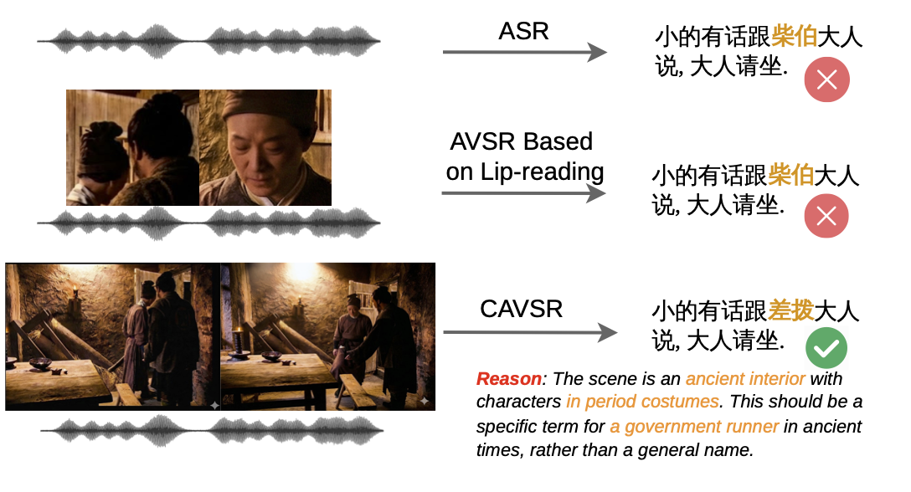
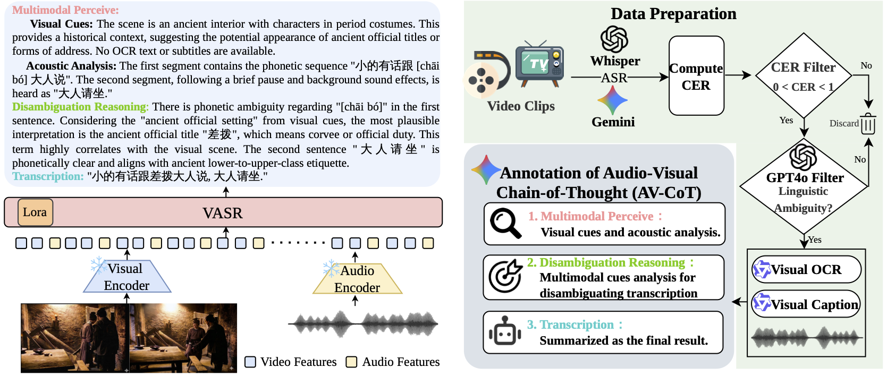

## Seeing the Context: Rich Visual Context-Aware Speech Recognition via Multimodal Reasoning

[](https://arxiv.org/pdf/2603.07263)

This repository contains the open-source implementation for **ContextAVSR**, a multimodal project leveraging **Qwen2.5-Omni-7B** for Context Audio-Visual Speech Recognition (AVSR) tasks. It includes training scripts, configuration details, and architectural assets.

## 📖 Introduction

ContextAVSR utilizes the powerful Qwen2.5-Omni model to process both visual and audio inputs for enhanced speech recognition capabilities. The project is built upon the [SWIFT](https://github.com/modelscope/swift) framework for efficient fine-tuning.

For detailed architectural diagrams and overall system design, please refer to the documents below:

## 🌐 Overall System Design



## 🏗️ Model Architecture



## 🛠️ Requirements

- Python 3.10
- PyTorch
- CUDA (compatible with your PyTorch version)
- [SWIFT](https://github.com/modelscope/swift) (ms-swift)

Detailed dependencies are listed in `requirements.txt`.

## 📦 Installation

Install the required dependencies:

```bash
pip install -r requirements.txt
```

## 🚀 Training

We provide a shell script to fine-tune the Qwen2.5-Omni-7B model using LoRA (Low-Rank Adaptation).

### Training Script

The main training script is located at `code/train.sh`. It uses `swift.cli.sft` to launch the training process.

**Key Configurations in the script:**

- **Model**: `Qwen/Qwen2.5-Omni-7B`
- **Training Method**: LoRA (Rank: 8, Alpha: 32, Dropout: 0.05)
- **Target Modules**: `all-linear`
- **Precision**: `bfloat16`
- **Gradient Accumulation**: 2
- **Learning Rate**: 1e-4

### How to Run

Ensure you have your datasets prepared (referenced in the script as `../data/*.jsonl`) and update the script paths if necessary.

Run the training command:

```bash
bash code/train.sh
```

### Data Preparation

The training script expects data in JSONL format. The default paths configured are:

- `../data/test_train.jsonl`
- Validation: `../data/test_val.jsonl`

Please ensure your data is formatted correctly for SWIFT SFT (Supervised Fine-Tuning) and placed in the appropriate directories.

## 🔄 Data Pipeline

The `code/datapipeline/` directory contains a suite of tools for processing and refining the multimodal dataset:

- **ASR & Audio Processing**:
  - `whisper_asr.py`: Uses `openai/whisper-large-v3` for offline speech recognition and WER calculation.
  - `doubao_api.py`: Connects to the Doubao ASR API for cloud-based speech recognition.

- **Data Tagging & Filtering**:
  - `Gemini_tagging.py`: Utilizes Gemini models to generate rich tags and metadata for video/audio content.
  - `GPT_filter_trainingdata_withgt.py`: Employs GPT-4o to filter and clean training data by comparing with ground truth.
  - `qwen3vl.py`: Deploys `Qwen3-VL` using vLLM to process visual information and generate multimodal descriptions.

## 📂 Directory Structure

```
open_source/
├── asset/              # Paper documentation (model.pdf, overall.pdf)
├── code/               # Training scripts (0202_qwen25omni7B-new.sh)
├── README.md           # Project documentation
└── requirements.txt    # Python dependencies
```